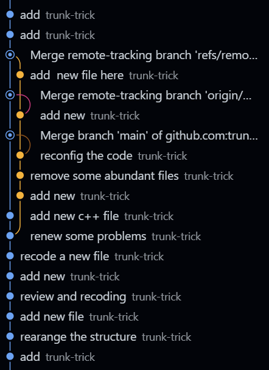

this is what I will talk below "git's theory"

where is git from ?
You have possibly heard that it descends from Linux.
That's right, despite that the first version of git dose not
However , this still makes sense. It solved many problems when designing Linux os with many developer online
That is the problem of version control --- the most troublesome problem with many developers

we will possibly failed to retreat to the former code cause we find our modification wrong this time
There are possibly some conflicts when we push our code inline while other developers is also modifying


How dose it sovled ?



this is my personal commit history.
Yes , I got two computer commiting this project. However , I forgot that I 've committed one in another computer
that I forgot to git pull, and when I ```git push``` it again, the system do not know which one is right
```git pull```
here, and then the conflicts occurred.
Case 1 : if the conflicts lies in different place(like creating a new file)
That is : we do not need to do other things. We can simply :
```git pull```, that is the combine ```git fetch``` and ```git merge```

Case 2 :
if you just want to keep the local modification here (discarding the remote modification) 
you can simply solve it by ```git rebase```
if two version of commit lies in almost one file(for example : you possibly want to do the same things here)

And it is a joint effort -- that is , you want keep part of the remote modification

so ,firstly , you try ```git pull```, find that there are conflicts

if you didn't commit your modification:
```git stash``` or ```git commit```
they actually play the same role here !that is remove your local unfinished code, such that the remote code can be 
directly put here.

### get remote code
```git fetch origin main```(or even ```git pull```)

and now try this :  ```git merge origin main```(or ```git stash pop```), if ok, then everything is done

and now we should look at the conflicts the IDE tells you, and keep what we want to keep.
then every thing is done

And if you want to switch to remote version(discard the local modification):
just ```git fetch origin main```
```git reset --hard origin/main```

And if you just want some of the file to be set the remote version:
```git fetch origin main```
```git checkout origin/main -- /path/to/file.cpp```

there is actually something used more often:
```git fetch origin main```
```git merge origin/main```
and right after this command, the conflicts occurred, we can use this
```git checkout --theirs path/to/conflict_files.cpp```
and do not forget to add again :  ```git add path/to/conflict_file.cpp```  || actually you can ```git add .```

and here now I've find one useful command here to share with you:
what if you find out that your github repo name is to bad for usage , like "---name-_example"
Yes,so you go to the github.com to change it. Then what you should do with the local repo related to it ?
use ```git remote add <name> <url>``` to add it again ?

If you did it : the system says : 
```
error: remote origin already exists.
```

So actually you should set url again :
```
git remote set-url origin <repo-url>
```

also : git status is a helpful tool --- used for looking up problems and the 


